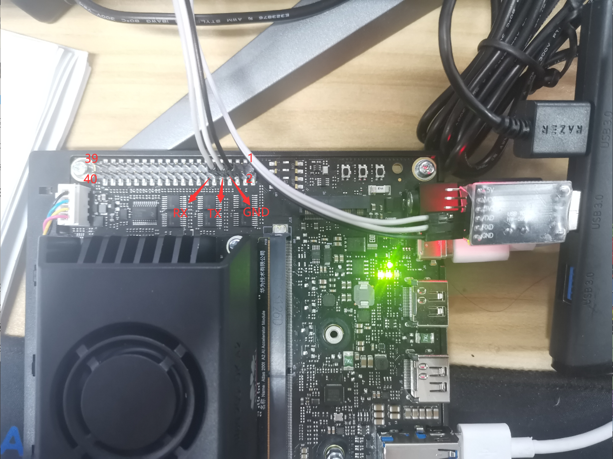
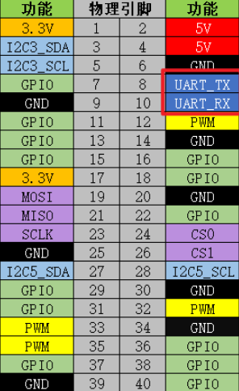

#
## 1、串口硬件接线
>UART0是8脚和10脚，用于昇腾AI处理器的默认调试串口（console），波特率115200。
| 串口 | 引脚 | 功能       |
| ---- | ---- | ---------- |
| TXD  | 8    | 发送信号线 |
| RXD  | 10   | 接收信号线 |



[昇腾40pin扩展接口定义](https://www.hiascend.com/document/detail/zh/Atlas200IDKA2DeveloperKit/23.0.RC2/Hardware%20Interfaces/hiug/hiug_0017.html)



## 2、串口通讯实验
>本实验中，我们的重点是使用前面Python库，来调用板卡上的串口资源。硬件上，通过板卡与USB转TTL模块连接到我们的电脑上， 并通过串口上位机来进行实验现象的演示和操作。
### 方式一：使用pySerial库
>官方文档链接：https://pythonhosted.org/pyserial/

- 简介

PySerial是一个Python库，用于与通过串行端口的硬件进行通信。它提供了一种简单的方式来读取和写入数据，支持多种串行协议。

- 要求

Python 2.7 或更高版本，包括 Python 3.4 和更高版本

### 安装

```
# 在板卡使用如下命令安装
pip install pyserial
```

### 使用

- 发送数据
  ```

  ```
- 接收数据
  ```

  ```


### minicom通讯
